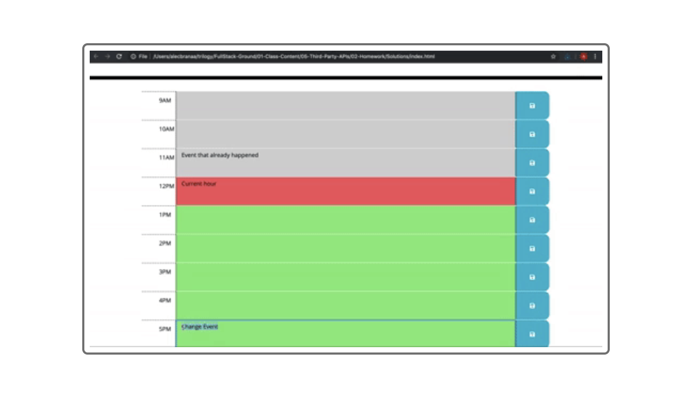

# Work Day Scheduler

## Purpose
A website that offers a place to save tasks from 9AM to 5PM for the current date. Color-coded each tasks to let the user know what tasks are past due, currently due and shows which tasks are upcoming in the future.
 

* Past current time = Gray
* Current time = Red
* Future = Green

## Built with
* HTML
* CSS
* JavaScript
* BootStrap
* jQuery
* Moment.js

## Website 
https://aarce96.github.io/work-day-scheduler/